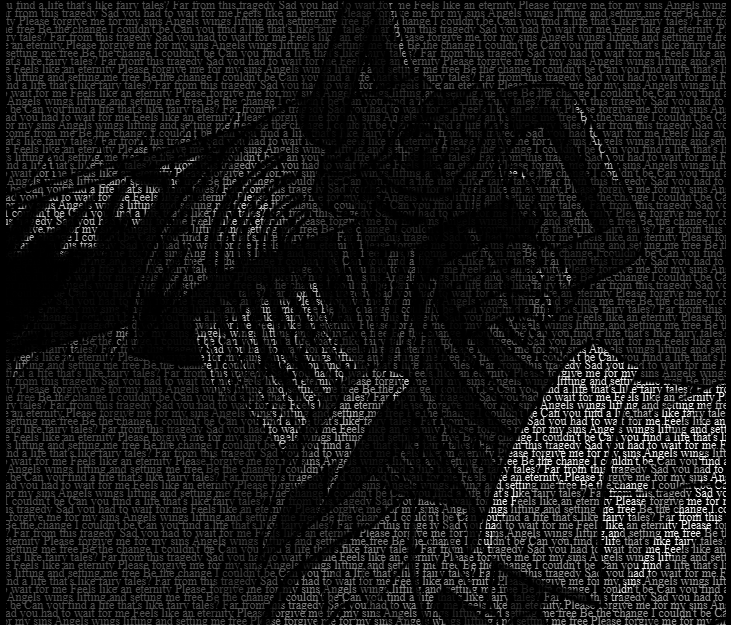

Portrait using HTML and CSS

A simple web design project that creates a portrait-style layout using only HTML and CSS.

📁 Project Structure
- `index.html` – Main HTML file
- `style.css` – Styling with CSS

🛠️ Built With
- HTML5
- CSS3

📷 Preview
)

✨ Features
- Pure HTML/CSS implementation
- Clean layout
- Fun learning experience
